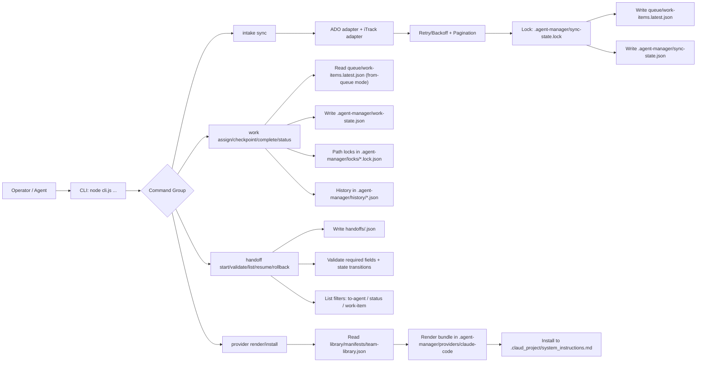
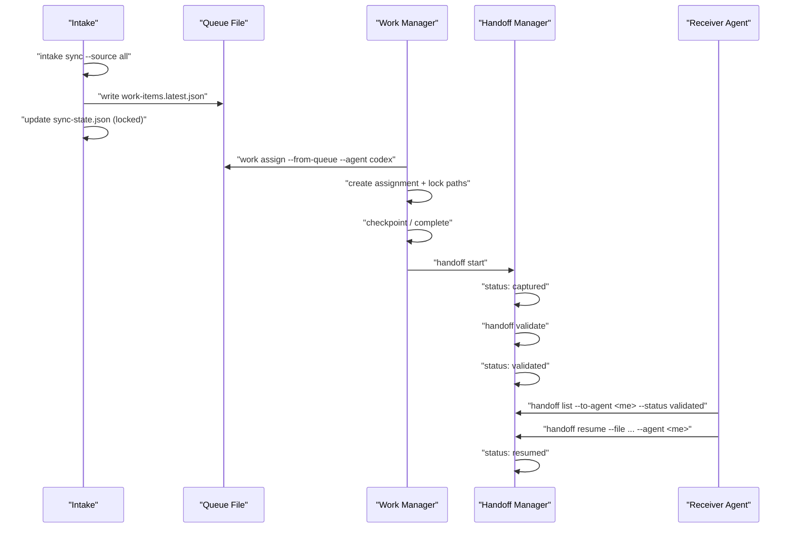

# Agent Manager

Repo-embeddable, provider-agnostic agent operations module for:

- Onboarding
- Handoffs
- Team workflows
- Code-management governance
- Work intake normalization (ADO, iTrack)

## v1 agent clients

- GitHub Copilot
- Claude Code
- Gemini CLI / Antigravity
- Windsurf
- Cursor
- OpenCode
- AskArchitect

## Quick start

1. Install Node 20+.
2. Validate structure and workflow contracts: `npm run validate`
3. Run intake sync:
   - `node cli.js intake sync --source ado`
   - `node cli.js intake sync --source itrack`
   - `node cli.js intake sync --source all`
4. Validate shared team library:
   - `node cli.js library check`
5. Validate workflows:
   - `node cli.js workflow check`

## For agents

### Discover capabilities

```bash
node cli.js describe system
node cli.js describe commands
node cli.js describe workflows
node cli.js describe config
```

### Register and onboard

```bash
node cli.js agent register --id codex-alpha --provider claude-code --capabilities nodejs,workflow
node cli.js agent heartbeat --id codex-alpha --status working
node cli.js agent list
node cli.js agent onboard --id codex-alpha --provider claude-code --capabilities nodejs,workflow
```

## Rust CLI Bootstrap

Parallel Rust implementation now lives at `rust-cli/agent-manager-rs`.

Current parity scope (read-only):

- `describe system|commands|workflows|config`
- `library list|show`
- `handoff list`
- `work status`

Run examples:

```bash
cargo run --manifest-path rust-cli/agent-manager-rs/Cargo.toml -- describe system
cargo run --manifest-path rust-cli/agent-manager-rs/Cargo.toml -- library list --kind skill
```

### Contribute to shared library

```bash
node cli.js library scaffold --kind skill --name "Error Boundary Pattern" > error-boundary.md
node cli.js library add --kind skill --name "Error Boundary Pattern" --owner codex-alpha --file error-boundary.md --tags resilience,error-handling
node cli.js library list --kind skill
node cli.js library show --id skill.error-boundary-pattern
node cli.js library remove --id skill.error-boundary-pattern
```

## Optional just runner

`just` is optional convenience only. The canonical interface is still `node cli.js` / `npm`.

If you use `just`, common shortcuts are:

- `just validate`
- `just test`
- `just workflow-check`
- `just library-check`
- `just provider-render`
- `just provider-install`
- `just intake-sync`
- `just intake-sync-dry`
- `just work-status`
- `just library-list`
- `just agent-list`
- `just describe-system`
- `just run handoff start --from codex --to architect ...`

## Architecture





## Handoff protocol

Create a structured handoff payload:

```bash
node cli.js handoff start \
  --from codex \
  --to architect \
  --work-item W-101 \
  --title "Improve intake reliability" \
  --goal "Ship retries and pagination" \
  --context-summary "ADO and iTrack adapters updated" \
  --decisions "retry-with-backoff,paginated-fetch" \
  --risks "provider-env-vars-required" \
  --open-loops "add-fixture-tests" \
  --next-commands "npm run validate,node cli.js workflow check" \
  --files-touched "intake/adapters/http.js,intake/adapters/ado/adapter.js" \
  --notes "ready for receiver"
```

Validate, resume, or rollback:

```bash
node cli.js handoff validate --file handoffs/<handoff-id>.json
node cli.js handoff resume --file handoffs/<handoff-id>.json --agent architect --notes "starting review"
node cli.js handoff rollback --file handoffs/<handoff-id>.json --agent architect --reason "missing artifact"
node cli.js handoff list --to-agent architect --status validated
```

## Work-state manager

Track assignments, checkpoints, and locks under `.agent-manager/`.

```bash
node cli.js work assign --work-item W-101 --agent codex --paths cli.js,intake/adapters/http.js
node cli.js work assign --from-queue --agent codex --priority 1
node cli.js work checkpoint --assignment <assignment-id> --label midpoint --note "adapter pass complete"
node cli.js work complete --assignment <assignment-id> --result "ready for PR"
node cli.js work status
```

## Provider bundle generation

Render a Claude Code bundle from shared library entries:

```bash
node cli.js provider render --provider claude-code
node cli.js provider install --provider claude-code
```

Generated files:

- `.agent-manager/providers/claude-code/system_instructions.md`
- `.agent-manager/providers/claude-code/bundle-metadata.json`
- `.claud_project/system_instructions.md` (after `provider install`)

## Intake env vars

### ADO

- `ADO_ORG`: Azure DevOps organization
- `ADO_PROJECT`: Azure DevOps project
- `ADO_PAT`: personal access token

### iTrack

- `ITRACK_BASE_URL`: base URL for iTrack API (example: `https://itrack.example.com`)
- `ITRACK_TOKEN`: bearer token
- Optional: `ITRACK_ISSUES_ENDPOINT` (default: `/api/issues`)

## Outputs

- `queue/work-items.latest.json`: normalized latest sync result
- `.agent-manager/sync-state.json`: per-source cursor and sync metadata
- `.agent-manager/work-state.json`: active and completed assignment state
- `.agent-manager/locks/*.json`: path-level lock records
- `.agent-manager/history/*.json`: completed assignment snapshots

## Shared Team Library

The shared library lives under `library/` and is tracked via:

- `library/manifests/team-library.json`

Supported catalog kinds:

- `agent`
- `hook`
- `skill`
- `plugin`
- `prompt`
- `tool`

Check integrity (duplicate IDs, invalid kinds, missing files):

- `node scripts/library-check.js`
- `node cli.js library check`
